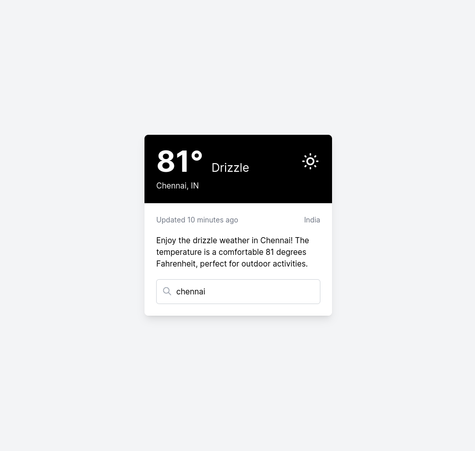

# Weather App



A sleek and responsive weather application built with modern web technologies. This app provides real-time weather information for any city, featuring a clean and intuitive user interface.

## Features

- Real-time weather data display
- Search functionality for any city worldwide
- Responsive design that works on desktop and mobile devices
- Displays temperature, weather condition, location, and last update time
- Utilizes OpenWeatherMap API for accurate weather information

## Technologies Used

- HTML5
- CSS3 (with Tailwind CSS for styling)
- JavaScript (ES6+)
- Vite (for build tooling and development server)
- OpenWeatherMap API

## Getting Started

### Prerequisites

- Node.js (version 12.0 or later)
- npm (usually comes with Node.js)

### Installation

1. Clone the repository:

```bash
git clone https://github.com/yourusername/weather-app.git
cd weather-app
```

2. Install the dependencies:

```bash
npm install
```


3. Create a `.env` file in the root directory and add your OpenWeatherMap API key:

```bash
VITE_WEATHER_API_KEY=your_api_key_here
```

### Running the App

1. Start the development server:

```bash
npm run dev
```

2. Open your browser and navigate to `http://localhost:5173` (or the port shown in your terminal).

### Building for Production

To create a production build:

```bash
npm run build
```


The built files will be in the `dist` directory.

## Usage

- The app initially displays weather for San Francisco.
- To check the weather for a different city, type the city name in the search bar and press Enter.
- The app will update with the current weather information for the searched city.

## Customization

- You can modify the `tailwind.config.js` file to customize the app's appearance.
- The main logic is in `main.js`, which you can edit to add more features or change existing functionality.

# Weather App Function Creation Guide

In this exercise, you'll create two key functions for our weather app: `fetchWeatherData` and `getWeather`. These functions will handle API requests and process the weather data.

## 1. fetchWeatherData Function

Create an asynchronous function named `fetchWeatherData` that takes a URL as a parameter. This function should:

* Use the `fetch` API to make a GET request to the provided URL.
* Handle potential errors during the fetch process.
* Parse the response as JSON.
* Return the parsed data if successful, or throw an error if unsuccessful.

Tips:
* Use `try/catch` for error handling.
* Remember to use `await` when calling `fetch` and parsing the response.
* Check if the response is okay (`response.ok`) before processing it.

## 2. getWeather Function

Create an asynchronous function named `getWeather` that takes a city name and optionally a units parameter (defaulting to 'imperial'). This function should:

* Use the `createApiUrl` function (already provided) to generate the API URL.
* Call `fetchWeatherData` with the generated URL.
* Process the received data using the `processWeatherData` function (already provided).
* Update the UI with the processed data using the `updateUI` function (already provided).
* Handle any errors that occur during this process and display an alert to the user.

Tips:
* Use `try/catch` for error handling.
* Remember to `await` the asynchronous calls.
* Use template literals for string interpolation when necessary.

## Testing Your Functions

After creating these functions, you can test them by:

1. Calling `getWeather('San Francisco')` in the console.
2. Entering a city name in the input field and pressing Enter.

Your functions should fetch and display weather data for the specified city.

## Contributing

Contributions are welcome! Please feel free to submit a Pull Request.

## License

This project is open source and available under the [MIT License](LICENSE).

## Acknowledgments

- Weather data provided by [OpenWeatherMap](https://openweathermap.org/)
- Icons by [Heroicons](https://heroicons.com/)
